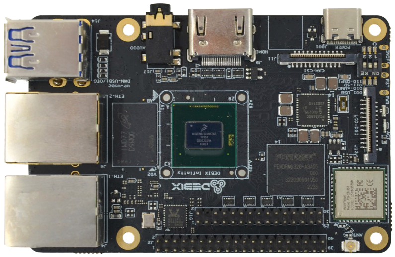
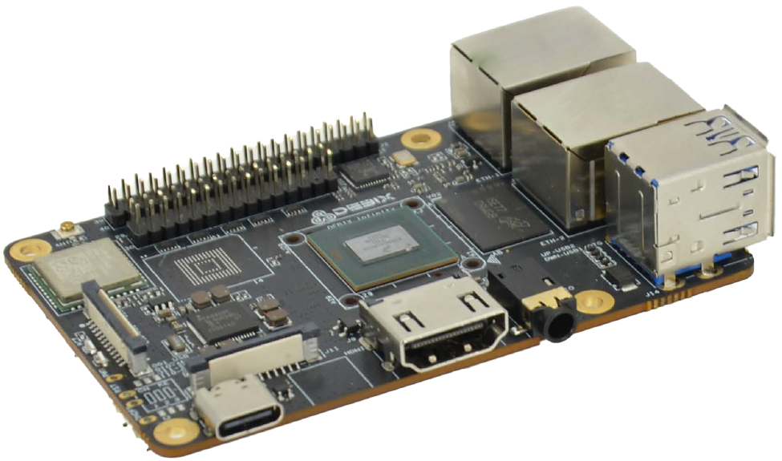
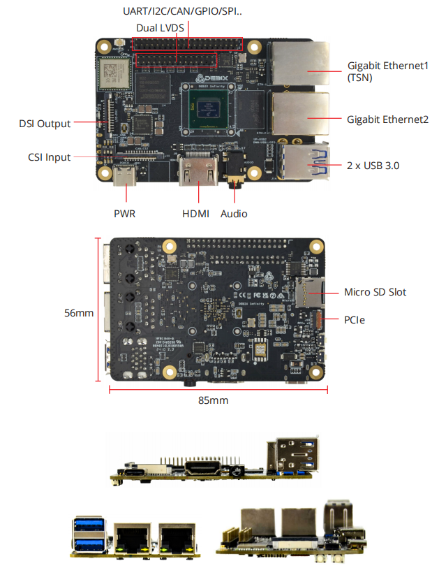

# DEBIX Infinity Industrial Single Board Computer
 

## Overview
DEBIX Infinity is an embedded board based on NXP i.MX 8M Plus Quad Lite, which provides a range of scalable interface options aimed at smart robots, Industry 4.0, edge 
computing, gateways, IoT, and security applications. 

Engineered to deliver more energy-efficient and cost-effective solutions for intelligent edge computing, DEBIX Infinity provides multiple extensible interfaces for IoT edge, contactless HMI, smart home, building control and industrial applications.

## Main Features
- **Performance:** Powerful quad-core Arm® Cortex®-A53 CPU at 1.6GHz indicates
sufficient processing power for demanding industrial applications.
- **Real-time control:** Cortex-M7 core and robust control network interfaces like dual
CAN FD and dual Gigabit Ethernet with one TSN support make it suitable for real-time
applications with strict timing requirements.
- **Industrial reliability:** Designed for critical environment condition and temperature
change, the wide CPU temperature range -40°C to 105°C make it can be used in
critical industrial environment, transportation and industry control etc.
- **Rich Connectivity:** A comprehensive range of connectivity options, including Gigabit
Ethernet, 2.4GHz & 5GHz Wi-Fi, Bluetooth 5.2, high-speed USB 3.0, and PCIe support.
This allows for easy connection and control of various industrial peripherals.
- **Complete Software Support:** Includes Android11/ Yocto-L6.6.36/ Ubuntu22.04/ Debian12
/ Windows 10 IoT Enterprise/ OpenWRT/ FreeRTOS operating system and basic software for
 fast and direct applications.

## Specification
| System          |                                                                         |
|-----------------|-------------------------------------------------------------------------|
| CPU             | NXP i.MX 8M Plus Quad Lite, MIMX8ML4CVNKZAB, 4 x Cortex-A53 1.6GHz      |
| Memory          | 2GB LPDDR4 (4GB optional, while 8GB is optional when opertaing temp. is -20℃ to 70℃) |
| Storage         | Micro SD card (Onboard 8GB/16GB/32GB/64GB/128GB/256GB eMMC optional)    |
| OS              | Android 11, Yocto-L6.6.36, Ubuntu 22.04, Debian 12, Win10 IoT Enterprise (also supports OpenWRT and FreeRTOS) *Note: 4GB/8GB LPDDR4 supports Windows 10 IoT, recommend 8GB version.*|
|**I/O Interfaces**|                                                                      
| Gigabit Ethernet| 2 x Gigabit Ethernet, one supports TSN and POE power supply (need POE power device module) |
| WiFi & BT       | NXP 88W8987 SoC: 2.4GHz & 5GHz Wi-Fi + BT 5.2                           |
| USB             | 2 x USB 3.0 Host Type-A (DWN_USB1 can be configured as OTG via software)|
| Audio           | 1 x Headphone and Mic combo port                                        |
| HDMI            | 1 x HDMI OUT                                                            |
|**Expansion**    |
| 40-Pin Dual-Row Header | (1) 3 x UART, 2 x I2C, 2 x SPI, 2 x CAN, 6 x GPIO for default, can be reused as I2S, PWM, SPDIF and GPIO through software configuration. (2) 5V power supply, system reset, ON/OFF|
| LVDS            | 1 x LVDS, single & dual channel 8bit                                    |
| MIPI CSI        | 1 x MIPI CSI (4-lane)                                           |
| MIPI DSI        | 1 x MIPI DSI (4-lane)                                           |
| PCIe            | 1 x PCIe Gen3 1-Lane                                                    |
| Slot            | 1 x Micro SD slot                                                       |
|**Power Supply**|
| Power Supply    | DC 5V/3A via Type-C                                                     |
|**Mechanical & Environmental**|
| Size            | 85.0mm × 56.0mm (±0.5mm)                                                |
| Operating Temp. | -20°C to 70°C (-40℃ to 85℃ optional)                                  |
| Net Weight      | 46g (±0.5g)                                                             |

## I/O Interfaces:

## Compatible with DEBIX's Accessories
| Product                     | Model               |
|-----------------------------|---------------------|
| DEBIX Fanless Aluminum Enclosure | EMC-7090B Infinity|
| I/O Board                   | EMB-AS-E01          |
| 4G Board                    | EMB-AS-05          |
| LoRa Board                  | EMB-AS-03          |
| SBC POE Board               | EMB-AS-06          |
| DEBIX Camera Modules        | Camera 200A; Camera 500A; Camera 1300A |
| DEBIX Display Screens       | DEBIX TD050A; DEBIX TD070A; DEBIX TD101A; DEBIX TD050H; DEBIX TD070H; DEBIX TD101H |

## Safety Instructions and Warnings:
**General:**
- Avoid exposure to water, moisture and conductive surfaces while operating.
- Handle with care to avoid mechanical or electrical damage to the circuit board and connectors.
- Only handle the board by the edges when powered on to minimize the risk of electrostatic discharge damage.

**Power:**
- Use only a 5V/3A DC minimum external power supply that complies with relevant regulations and standards for your country.

**Environment:**
- Operate in a well-ventilated environment, even if using a case.
- Place on a stable, flat, non-conductive surface and avoid contact with conductive items.

**Connections:**
- Only connect compatible devices to the GPIO ports to avoid damage and warranty
voiding.
- Use peripherals that comply with relevant standards for the country of use and ensure proper insulation and operation.

**Additional notes:**
- This summary is not exhaustive, please refer to the full User Manual for details.
- If you are unsure about any aspect of safety or operation, consult a qualified
professional.

## Contact Us
- **Headquarters**: DEBIX Technology Inc., 8345 Gold River Ct., Las Vegas, NV 89113, USA  
- **Factory**: 5-6/F., East Zone, Shunheda A2 Building, Liqxiandong Industrial Park, XiLi, Nanshan Dist., Shenzhen, China  
- **Email**: info@debix.io  
- **Website**: [www.debix.io](https://www.debix.io)  
- **Community**: [Discord](https://discord.com/invite/adaHHaDkH2)